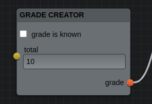
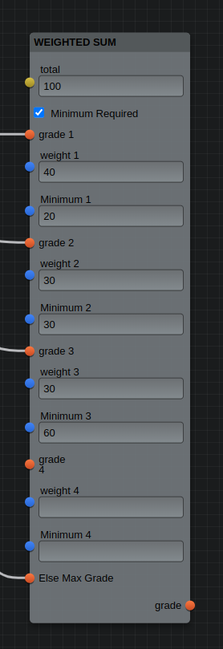
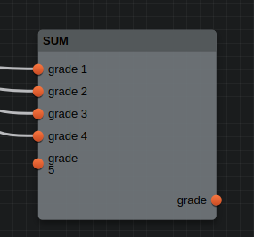
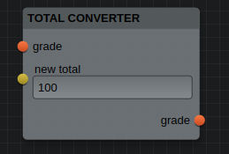
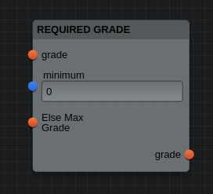
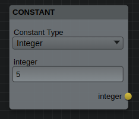
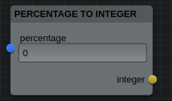
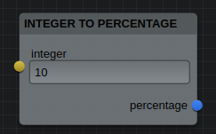

# Gradeculator | Show&Tell
This Project is a project for the course
CS 391 at Boston University Summer Term 2 2024.

This Project is done for the 'Show & Tell' extra credit.

This project uses flume, you can install flume using
```shell
npm install flume
```

For styling this project uses styled components
```shell
npm install styled-components
```

## Explanation
This project its goal is to make a project using <strong>flume</strong>. In this project I made visual tool so users can
write visual code to estimate their grade. Grades can be created using a gradeCreator

By hooking this grade up to the Result node, the grade information can be retrieved and be used
in other pages of the webpage. 
There are more types of nodes, to give the user more options to customize the visual grade calculation script.
Users can add new nodes by right-clicking and selecting the node they want. When right-clicking while hovering over a node the user can 
also remove the node


## List of port types
- Grade (Object containing gradeRange)
- Integer (floored Number)
- Percentage (decimal value, not constraint in range but often used between 0-100%)
- operation (string) (used to choose between a list of operations to execute)
- constantType (list of types a constant can be)
- boolean (boolean)

## List of node Types

### GradeCreator

- <p> This node let the user create a grade object. This node has a boolean 'grade known', when this is not selected, the grade range will 
      assume that the grade is between 0 and 100%, if it is known the gradeRange will just be lower and upper bound equal to the exact grade.
  </p>
- Inputs

  |  InputName  |  Type   | Purpose                                                                                                  |
  |:-----------:|:-------:|:---------------------------------------------------------------------------------------------------------|
  | Grade Known |  BOOL   | Provide whether or not the grade is already known (and providable)                                       |
  |    score    | INTEGER | The score the person had on a assignment/quiz/exam, .. (only appears when the 'grade known' is selected) |
  |    total    | INTEGER | Total amount of points the grade was scaled on                                                           |

- Outputs

    | OutputName | Type  | Purpose                |
    |:----------:|:-----:|:-----------------------|
    |   Grade    | GRADE | resulting grade object |

### Weighted Sum:

- <p>
    This node let the user take a weighted sum of the grades. THe user can provide a grade with a corresponding weight (in %), it also has an option to use minimum requirements.
    When using minimum requirements, each sub grade needs to have a grade higher than the minimum percentage, if it fails so, the final grade will be the lesser grade between the weighted average and the else grade.
    In short this means that for example 2 grades need to be above 50%, so their result can be above 50%. Such requirements for grades are things that are sometimes used for grading.
  </p>
- Inputs

  |    InputName     |    Type    | Purpose                                                         |
  |:----------------:|:----------:|:----------------------------------------------------------------|
  |      total       |  INTEGER   | Total amount of points the output grade will be scaled on       |
  | minimum required |  BOOLEAN   | decide if we use minimum requirements for each sub grade or not |
  |     grade 1      |   GRADE    | first provided grade                                            |
  |     weight 1     | PERCENTAGE | first weight corresponding to grade 1                           |
  |    minimum 1     | PERCENTAGE | first minimum corresponding to grade 1 (if using minimum)       |
  |       ...        |    ...     | ...                                                             |
  |     grade n      |   GRADE    | first provided grade                                            |
  |     weight n     | PERCENTAGE | first weight corresponding to grade 1                           |
  |    minimum n     | PERCENTAGE | first minimum corresponding to grade 1 (if using minimum)       |
- Outputs

  | OutputName | Type  | Purpose                |
  |:----------:|:-----:|:-----------------------|
  |   Grade    | GRADE | resulting grade object |
      
### Sum:

  - Take a sum of the grades. The weight of each grade depends on the total points of each grade
  - Inputs

    |    InputName     |    Type    | Purpose                                                         |
    |:----------------:|:----------:|:----------------------------------------------------------------|
    |     grade 1      |   GRADE    | first provided grade                                            |
    |       ...        |    ...     | ...                                                             |
    |     grade n      |   GRADE    | first provided grade                                            |
  - Outputs

    | OutputName | Type  | Purpose                |
    |:----------:|:-----:|:-----------------------|
    |   Grade    | GRADE | resulting grade object |

### Total Converter:

 - Convert the total amount of points for a grade to another total, while keeping the same percentage
 - Inputs

    | InputName |  Type   | Purpose         |
    |:---------:|:-------:|:----------------|
    |   Grade   |  GRADE  | grade object    |
    | new total | INTEGER | new total value |

  - Outputs

    | OutputName | Type  | Purpose                |
    |:----------:|:-----:|:-----------------------|
    |   Grade    | GRADE | resulting grade object |

### Required Grades

- Require that the grade is higher than the minimum else give it the minimum of the else grade and the actual grade
- Inputs

  | InputName |    Type    | Purpose                              |
  |:---------:|:----------:|:-------------------------------------|
  |   Grade   |   GRADE    | grade object                         |
  |  Minimum  | PERCENTAGE | the minimum grade percentage we need |
  | Else Max  |   GRADE    | alternative grade                    |

- Outputs

  | OutputName | Type  | Purpose                |
  |:----------:|:-----:|:-----------------------|
  |   Grade    | GRADE | resulting grade object |

### Integer Operation

- Node to do arithmetic with integers
- Inputs

  | InputName |   Type    | Purpose                                                             |
  |:---------:|:---------:|:--------------------------------------------------------------------|
  | Integer1  |  INTEGER  | Integer used in calculation                                         |
  | Integer2  |  INTEGER  | Integer used in calculation (some operations don't have this input) |
  | operation | OPERATION | chose of arithmetic operation                                       |

- Outputs

  | OutputName |  Type   | Purpose           |
  |:----------:|:-------:|:------------------|
  |  Integer   | INTEGER | resulting integer |

### Constant

- A way to create constant integer/percentage
- Inputs

  |     InputName      |        Type        | Purpose                                             |
  |:------------------:|:------------------:|:----------------------------------------------------|
  |    constantType    |    CONSTANTTYPE    | decide which type of constant we want (pct/integer) |
  | integer/percentage | INTEGER/PERCENTAGE | depending on constantType                           |

- Outputs

  |     OutputName     |        Type        | Purpose                                                |
  |:------------------:|:------------------:|:-------------------------------------------------------|
  | Integer/percentage | INTEGER/PERCENTAGE | resulting integer/percentage depending on constantType |

### Percentage To Integer

- Converts a percentage to an integer (rounding will occur). (50% -> int: 50)
- Inputs

  | InputName  |    Type    | Purpose          |
  |:----------:|:----------:|:-----------------|
  | Percentage | PERCENTAGE | percentage input |

- Outputs

    | OutputName |  Type   | Purpose           |
    |:----------:|:-------:|:------------------|
    |  Integer   | INTEGER | resulting integer |

### Integer To percentage

- Converts an integer to a percentage
- Inputs

  | InputName |  Type   | Purpose                               |
  |:---------:|:-------:|:--------------------------------------|
  |  Integer  | INTEGER | integer needed to be converted to pct |

- Outputs

  | OutputName |    Type    | Purpose              |
  |:----------:|:----------:|:---------------------|
  | Percentage | PERCENTAGE | resulting percentage |

## Important observations
- ``<NodeEditor/>`` Takes up the entire space, so it is recommended to put it in a div with a defined width and height
- You have not much freedom/customization options
- Give each node type each own file, because the code can become long
- default values for controls do not work when the ports are dynamically generated

## Side Notes
Grades and weights are not constraint, so a user could give himself/herself 11/10 or a weight (in weightedSum) of 200%, this is to allow flexibility for things like extra credit.
